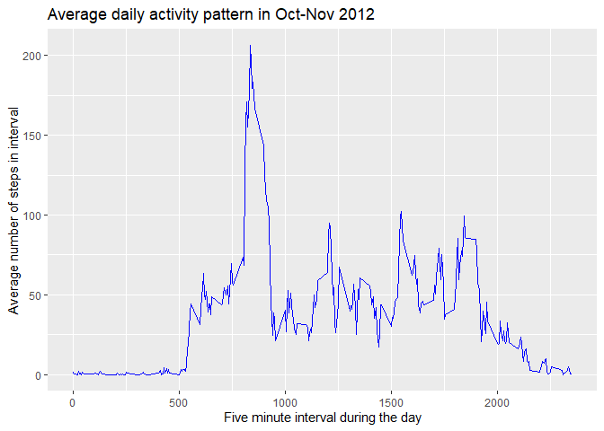
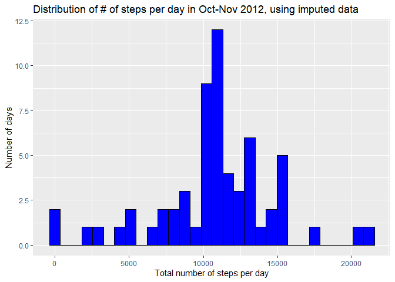
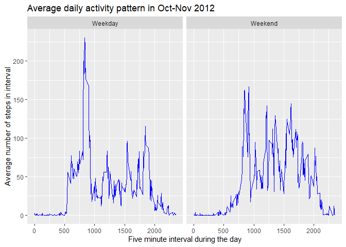

## Loading and preprocessing the data
The dataset of interest consists of activity data collected at five minute
intervals during October and November 2012 from an anonymous individual. The
data are in .csv form and include 17,568 observations.

Here we load the R packages we want to use to manage and analyze the data, and
import the data file.


```r
library(tidyverse)
```

```
## -- Attaching packages ---------------- tidyverse 1.3.0 --
```

```
## v ggplot2 3.3.2     v purrr   0.3.4
## v tibble  3.0.3     v dplyr   1.0.0
## v tidyr   1.1.0     v stringr 1.4.0
## v readr   1.3.1     v forcats 0.5.0
```

```
## -- Conflicts ------------------- tidyverse_conflicts() --
## x dplyr::filter() masks stats::filter()
## x dplyr::lag()    masks stats::lag()
```

```r
unzip("C:/Work/Templates/GitHub-Repositories/RepData_PeerAssessment1/activity.zip")
act_data <- read.csv("C:/Work/Templates/GitHub-Repositories/RepData_PeerAssessment1/activity.csv", header=T)
names(act_data)
```

```
## [1] "steps"    "date"     "interval"
```

```r
head(act_data)
```

```
##   steps       date interval
## 1    NA 2012-10-01        0
## 2    NA 2012-10-01        5
## 3    NA 2012-10-01       10
## 4    NA 2012-10-01       15
## 5    NA 2012-10-01       20
## 6    NA 2012-10-01       25
```

```r
dim(act_data)
```

```
## [1] 17568     3
```

## What is mean total number of steps taken per day?
Here we calculate the total number of steps taken per day, make a histogram of
the total number of steps, and calculate the mean and median of the total number
of steps per day.


```r
# calculate total number of steps per day
act_bydate <- act_data %>% 
  group_by(date) 
tot_bydate <- act_bydate %>% 
  summarise(totsteps = sum(steps, na.rm=T))
```

```
## `summarise()` ungrouping output (override with `.groups` argument)
```

```r
# histogram of total number of steps per day
hist1 <- ggplot(tot_bydate, aes(x=totsteps)) + 
  geom_histogram(color="black", fill="blue",bins=30)
# add title and axis labels
hist1 + 
  ggtitle("Distribution of total number of steps per day in Oct-Nov 2012") +
  labs(y = "Number of days", x = "Total number of steps per day")
```

<!-- -->

The mean number of steps taken per day was 9354.23.
The median number of steps taken per day was 10395.


## What is the average daily activity pattern?
Here we calculate the average number of steps taken in each five minute interval
across all days, and display it using a time series plot.


```r
# calculate average number of steps per interval across all days
act_byint <- act_data %>% 
  group_by(interval) 
avg_byint <- act_byint %>% 
  summarise(avgsteps = mean(steps, na.rm=T))
```

```
## `summarise()` ungrouping output (override with `.groups` argument)
```

```r
# identify interval with the maximum number of steps
max_int <- avg_byint %>% 
  filter(avgsteps == max(avgsteps))

# plot time series of average daily activity pattern
time1 <- ggplot(avg_byint, aes(x=interval, y=avgsteps)) + 
  geom_line(color="blue")
# add title and axis labels
time1 + 
  ggtitle("Average daily activity pattern in Oct-Nov 2012") + 
  xlab("Five minute interval during the day") + 
  ylab("Average number of steps in interval")
```

<!-- -->

On average across all the days in the dataset, the 5-minute interval that
contains the maximum number of steps was interval number 835.


## Imputing missing values
Here we calculate the total number of missing values in the dataset. We then 
impute missing values using the mean of values in that same interval. Finally, we display a histogram of the total number of steps taken per day, using the imputed data, and report the mean and median of the total number of steps taken per day.


```r
# calculate total number of observations with missing value for steps
sum(is.na(act_data))
```

```
## [1] 2304
```

```r
# replace missing values with mean value for same interval
imp_data <- act_data %>% 
  group_by(interval) %>% 
  mutate(steps = ifelse(is.na(steps), mean(steps, na.rm=T), steps))
totimp_bydate <- imp_data %>% 
  group_by(date) %>%
  summarise(totsteps = sum(steps, na.rm=T))
```

```
## `summarise()` ungrouping output (override with `.groups` argument)
```

```r
# histogram of total number of steps per day, using imputed data
hist2 <- ggplot(totimp_bydate, aes(x=totsteps)) + 
  geom_histogram(color="black", fill="blue",bins=30)
# add title and axis labels
hist2 + 
  ggtitle("Distribution of # of steps per day in Oct-Nov 2012, using imputed data") +
  labs(y = "Number of days", x = "Total number of steps per day")
```

<!-- -->

There are 2304 observations with missing data in the original activity dataset.

Using the imputed data, the mean number of steps taken per day was 1.076619\times 10^{4}.
Using the imputed data, the median number of steps taken per day was 1.076619\times 10^{4}.

As illustrated above, the estimates of the mean and median number of steps taken per day were higher when using the imputed data since missing values were replaced with step counts.


## Are there differences in activity patterns between weekdays and weekends?
Here we investigate whether activity patterns vary for weekdays vs. weekends. 
We create a new factor variable to identify weekdays vs. weekend days and
create a panel plot to show the daily activity patterns for weekdays vs.
weekend days.


```r
# create factor variable to identify weekday vs. weekend day
# using imputed data
imp_data$date2 <- as.Date(imp_data$date)
week_data <- imp_data %>%
  mutate(day = weekdays(date2)) %>%
  mutate(day_type = ifelse(day == "Monday" | day == "Tuesday" | 
                             day == "Wednesday" | day == "Thursday" |
                             day == "Friday", 1, 0))
  
week_data$day_type2 <- as.factor(week_data$day_type)
levels(week_data$day_type2) <- c("Weekend","Weekday")

# calculate average daily activity pattern on weekdays vs. weekend days
weekend <- week_data %>%
  filter(day_type2 == "Weekend") %>%
  group_by(interval) %>%
  summarise(avgsteps = mean(steps))
```

```
## `summarise()` ungrouping output (override with `.groups` argument)
```

```r
weekday <- week_data %>%
  filter(day_type2 == "Weekday") %>%
  group_by(interval) %>%
  summarise(avgsteps = mean(steps))
```

```
## `summarise()` ungrouping output (override with `.groups` argument)
```

```r
# put back together into one dataset
as.factor(weekend$day_type2 <- "Weekend")
```

```
## [1] Weekend
## Levels: Weekend
```

```r
as.factor(weekday$day_type2 <- "Weekday")
```

```
## [1] Weekday
## Levels: Weekday
```

```r
all_days <- rbind(weekend, weekday)

# panel plot showing average daily activity pattern
# separately for weekend days vs weekdays
time2 <- ggplot(all_days, aes(x=interval, y=avgsteps)) + 
  geom_line(color="blue") + facet_wrap(~ day_type2)
# add title and axis labels
time2 + 
  ggtitle("Average daily activity pattern in Oct-Nov 2012") + 
  xlab("Five minute interval during the day") + 
  ylab("Average number of steps in interval")
```

<!-- -->

As shown in the plot above, on weekdays, activity starts earlier in the day and is fairly low during work hours, whereas, on weekends, activity starts later but is more consistent throughout the day.
